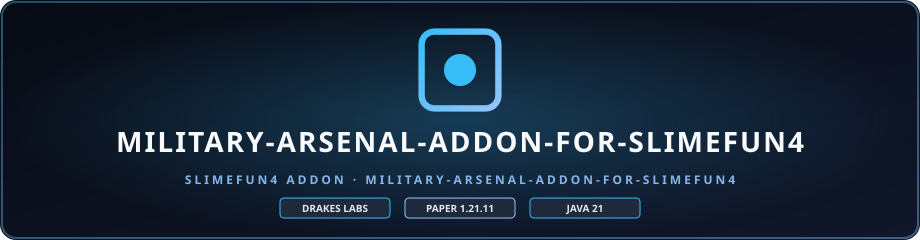

<p align="center">
    
</p>

<p align="center">
    <a href="https://github.com/DrakesCraft-Labs/Military-Arsenal/releases">
        
    </a>
    <a href="https://github.com/DrakesCraft-Labs/Military-Arsenal/actions">
        
    </a>
    <a href="https://modrinth.com/plugin/weaponsaddon">
        
    </a>
    <a href="https://www.curseforge.com/minecraft/bukkit-plugins/military-weapons-for-slimefun4">
        
    </a>
    <a href="LICENSE">
        
    </a>
    
    
    
    
</p>

# ⚔️ Military Arsenal — Advanced Warfare para Slimefun

> Transforma tu servidor de Slimefun en un campo de batalla tactico con tecnologia militar de vanguardia.

**Military Arsenal** es un addon de combate para **Slimefun4-Drake** con armas de fuego, municion dedicada, torretas defensivas, maquinas de guerra, progresion Void/Antimateria y bombardeo por coordenadas GPS.

⚠️ **Disclaimer**: addon comunitario **no oficial**; no esta afiliado ni respaldado por el equipo oficial de Slimefun4.

---

## 🚀 Features

### 🔫 Armas y municion
- **Machine Gun** — ametralladora de disparo por rafagas: 5 disparos rapidos, 5 HP por bala (25 HP por rafaga), indestructible, efectos de particulas y sonidos realistas
- **Antimatter Rifle** — arma endgame con progresion Void/Antimateria
- **Sistema de municion** — balas fabricables con consumo automatico al disparar
- **Weapon Upgrade Table** — modulos de mejora de dano y velocidad

### 🛡️ Sistemas defensivos
- **Torretas** Attack, Sniper, Melee y Machine Gun con progresion en 4 etapas
- **Torreta montable clase Wraith** — maquina de guerra pilotable
- Estructuras NBT multinivel con proteccion de mejora/desmantelamiento

### 💣 Maquinas y guerra
- **Bombardment Terminal** — ataque aereo por coordenadas GPS exactas (X Y Z), GUI interactiva con energia en tiempo real, doble combustible (TNT + Nether Stars) y 2 oleadas de 4 bombas TNT
- **Military Crafting Table** y **Military Machine Fabricator** — mesas de crafting militar
- **Ammunition Workshop** — taller de municion
- **Antimatter Pedestal y Ritual** — progresion de antimateria
- **Military Vouchers**, **armadura Void** y componentes por niveles (Circuito Militar → Targeting System / Guidance Chip / Reinforced Frame → Quantum Processor / Explosive Core)

---

## 🧰 Compatibilidad

| Componente | Rango |
|---|---|
| **Servidor** | Paper / Purpur **26.2+** (target de compilacion) |
| **Deteccion de version (VersionSafe)** | Minecraft Java **1.20.4 → 1.21.11** |
| **Java runtime** | 25 (build) / 21-compatible bytecode |
| **Slimefun** | Slimefun4-Drake v11 (obligatorio) |
| **Networks** | Opcional (carga antes para registrar recetas) |

El `VersionSafe` resuelve por reflexion atributos, materiales, encantamientos, sonidos, particulas y pociones tanto con los nombres modernos (sin prefijo `GENERIC_`, `IRON_CHAIN`) como con los de 1.20.4–1.21.1 (`GENERIC_ATTACK_DAMAGE`, `CHAIN`), sin referencia estatica a simbolos que no existen en servidores antiguos.

---

## 📥 Instalacion

1. Instala **Slimefun4-Drake v11** en un servidor Paper/Purpur **26.2+** con **Java 25**.
2. Descarga `MilitaryArsenal-v1.1.3.jar` desde [GitHub Releases](https://github.com/DrakesCraft-Labs/Military-Arsenal/releases), [Modrinth](https://modrinth.com/plugin/weaponsaddon) o [CurseForge](https://www.curseforge.com/minecraft/bukkit-plugins/military-weapons-for-slimefun4).
3. Coloca el JAR en el directorio `plugins/` del servidor.
4. Reinicia el servidor por completo.
5. Abre la guia de Slimefun (`/sf guide`) y navega a la categoria **MILITARY ARSENAL**.

**Networks** es opcional: Military Arsenal carga antes que Networks para que sus items y recetas queden registrados antes de que Networks construya sus indices.

---

## 💥 Bombardment Terminal

El unico limite horizontal del bombardeo es el **world border** del mundo donde esta el terminal: los objetivos deben estar dentro del borde del mundo, en un chunk ya cargado y dentro de los limites de altura del mundo. No existe distancia maxima fija desde el terminal.

```yaml
bombardment:
  cooldown_seconds: 30
```

La ejecucion retardada de misiles revalida el borde del mundo y el estado del chunk antes de generar efectos o TNT.

---

## 🔐 Seguridad / anti-dupe

El build falla si reaparecen APIs o firmas de escalamiento de privilegios/backdoor (comandos de consola, OP, pardons, attachment dinamico de permisos, etc.).

- Inventarios persistentes de maquinas copiadas bloqueados a un jugador por bloque.
- Las maquinas con inventario copiado activo estan protegidas contra rotura y explosiones.
- Shift-click y drag-transfer bloqueados en GUIs sensibles.
- Los slots de resultado de crafting 4x4 y 6x6 son take-only.
- Los resultados no reclamados se devuelven al cerrar la GUI.

---

## 🛠️ Build

Compila con JDK 25 (el bytecode generado es compatible con Java 21+):

```bash
mvn -B -Dmaven.test.skip=true clean package
```

El JAR final se escribe en `target/MilitaryArsenal-v1.1.3.jar`. GitHub Actions publica el JAR directo y los tags adjuntan el mismo JAR a la GitHub Release.

---

## 📖 Documentacion

- [Como_Funciona.md](Como_Funciona.md) — guia completa del addon (items, recetas, maquinas y mecanicas)
- [GitHub Issues](https://github.com/DrakesCraft-Labs/Military-Arsenal/issues) — reporta bugs y sugiere mejoras

---

## 📜 Licencia

Military Arsenal se distribuye bajo la **GNU General Public License v3.0** incluida en este repositorio. Autor original: Chagui68.

Minecraft es una marca de Microsoft/Mojang. Este proyecto es un addon comunitario independiente y **no esta afiliado, respaldado ni patrocinado por Microsoft o Mojang**. Slimefun y los demas proyectos referenciados pertenecen a sus respectivos autores y mantenedores.

---

<div align="center">

**DrakesCraft Labs** · Desarrollado con 💚 para la comunidad de Slimefun

</div>